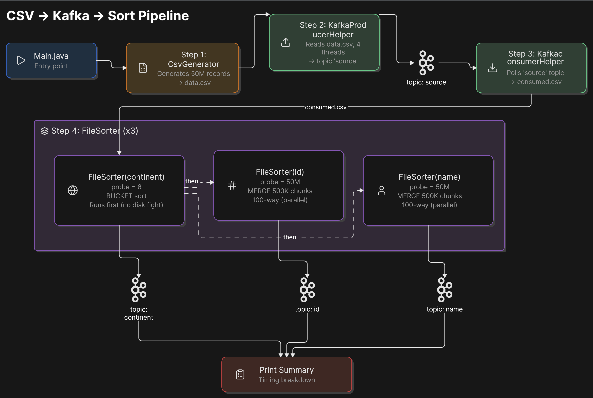
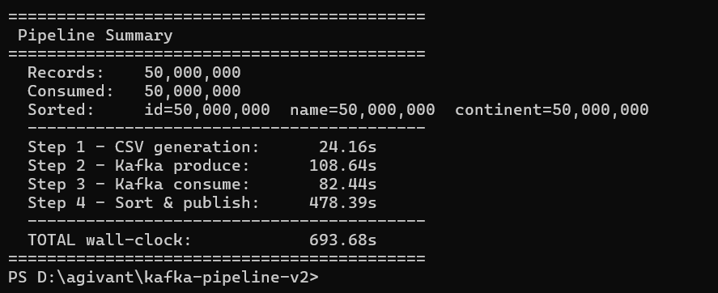
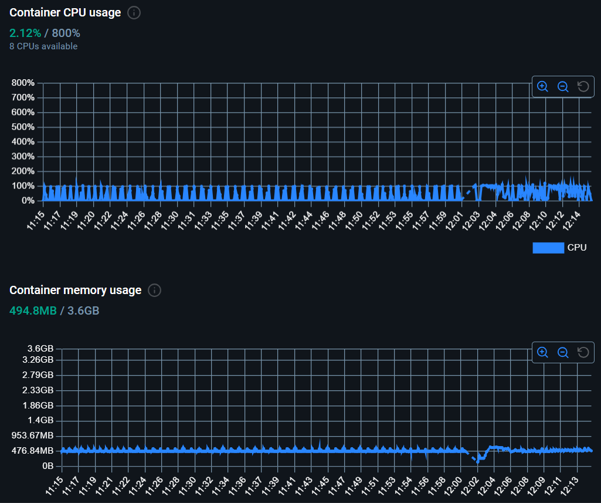

# Kafka Pipeline v2 — Data Generation & Sorting Pipeline

A high-performance pipeline that generates **50 million** random CSV records, produces them to Kafka, and sorts by 3 keys into separate output topics — all within **2GB RAM / 4 cores**.

## Architecture



## Schema

| Field | Type | Description |
|-------|------|-------------|
| id | int32 | Random integer within 32-bit range |
| name | string (10–15) | English characters only |
| address | string (15–20) | Mix of numbers, characters, spaces |
| continent | enum | North America, Asia, South America, Europe, Africa, Australia |

Example: `21,axxxxxxxxx,12 abc dfsf LdUE,Asia`

## Project Structure

```
src/main/java/com/pipeline/
├── Main.java                        # Orchestrator — 4-step pipeline
├── model/Record.java                # CSV record (fast indexOf parse, no regex)
├── generator/CsvGenerator.java      # ThreadLocalRandom + 4MB write buffer
├── kafka/KafkaProducerHelper.java   # 4-thread producer, BlockingQueue, poison pill
├── kafka/KafkaConsumerHelper.java   # Subscribe-based consumer group, offset tracking
└── sorter/FileSorter.java           # Cardinality probe → bucket or merge sort
```

## How It Works

| Step | Class | What it does | Key technique |
|------|-------|-------------|---------------|
| 1 | `CsvGenerator` | Generate 50M random CSV rows → `data.csv` | `ThreadLocalRandom`, 4MB buffer |
| 2 | `KafkaProducerHelper` | Read CSV → produce to Kafka `source` topic | 4 threads, `BlockingQueue`, lz4 compression |
| 3 | `KafkaConsumerHelper` | Consume from `source` → write `consumed.csv` | `subscribe()`, offset-based completion detection |
| 4 | `FileSorter` ×3 | Sort by continent/id/name → 3 Kafka topics | Bucket sort (≤200 distinct) or external merge sort |

### Sorting Algorithm

**Auto-selected** via cardinality probe (sample first 500K records):

- **Bucket Sort** — continent has 6 values → O(N), write to 6 bucket files, stream in order
- **External Merge Sort** — id/name have millions of values → O(N log N):
  1. Split into 500K-record chunks → `Arrays.parallelSort()` each
  2. 100-way merge via `PriorityQueue` (min-heap) → stream directly to Kafka

## Key Optimizations

| Optimization | Impact |
|-------------|--------|
| Consume Kafka once, sort 3 ways from same file | Saves ~200s vs 3 consumers |
| Continent first (alone), then id+name parallel | No 3-way disk contention |
| Bucket sort for continent (6 values) | O(N) vs O(N log N) |
| 500K chunks, MAX_FAN_IN=100 | Single merge pass for 50M records |
| Merge directly to Kafka (no sorted file) | Saves 3.5GB disk write per sort |
| lz4 compression, 256KB batches, 64MB buffer | ~60% network I/O reduction |
| G1GC, StringDeduplication, 768MB heap | Fits within 2GB total with Kafka |

## Benchmarks (50M records)

| Metric | HDD | SSD |
|--------|-----|-----|
| **Total** | **~25 min** | **~13 min** |
| Step 1 (generate) | 27s | 24s* |
| Step 2 (produce) | 140s | 108s* |
| Step 3 (consume) | 83s | 82s* |
| Step 4 (sort) | 1244s | 478s |



## Resource usage (Docker Desktop)



CPU — peaks at ~2.12% of total 8‑CPU capacity (≈170% normalized to 2 CPUs), showing only minor activity spikes and staying well within the 2‑CPU cap.

Memory — peaks at ~494.8 MB out of 3.6 GB (≈0.5 GB per container), holding steady around ~476 MB baseline with a brief dip, leaving ample headroom under the 1 GB limit.

## Quick Start

### Docker (recommended)
```bash
docker compose up kafka -d          # Start Kafka
docker compose run pipeline         # Run full 50M pipeline
docker compose run pipeline 1000    # Smoke test
```

### Local
```bash
mvn clean package -q

java -Xms256m -Xmx768m \
-Dorg.slf4j.simpleLogger.defaultLogLevel=error \
-jar target/kafka-pipeline-v2-1.0.0.jar \
--count 50000000 --bootstrap localhost:29092 --dataDir C:\pipeline-data
```

## Verify Correctness

```bash
docker cp verify.sh kafka-v2:/tmp/verify.sh
docker exec kafka-v2 sh /tmp/verify.sh
```

Checks: record counts (50M per topic), id sorted numerically, name/continent sorted alphabetically.

## Scaling to 1B+ Records

1. **Merge sort scales linearly** — 1B = 2000 chunks → 2 merge rounds (2000→20→Kafka)
2. **More Kafka partitions** → more parallel consumers
3. **Distributed sort** — 10 machines × 100M records each
4. **Key-based partitioning** — use continent as Kafka key for free pre-bucketing
